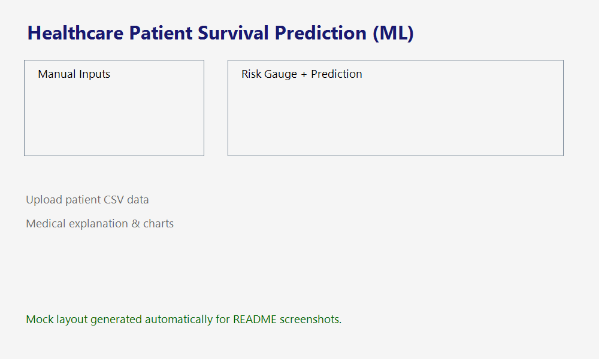

# Healthcare Patient Survival Prediction (ML)

End-to-end heart disease survival risk prediction system built with Python. It ingests the public UCI/Kaggle Cleveland Heart Disease dataset, performs EDA, preprocesses features, trains and evaluates multiple models, and surfaces predictions through an API-ready module plus a Streamlit application.

## Dataset

- **Source:** [UCI Machine Learning Repository – Heart Disease](https://archive.ics.uci.edu/ml/datasets/heart+Disease)
- Stored locally at `data/raw/heart.csv`. Each row represents a patient record with demographics, vitals, and cardiac stress test measurements. The `target` column is converted into a binary outcome (0 = survived/no disease, >0 = high-risk).

## Project Structure

```
├── app/
│   └── streamlit_app.py
├── data/
│   └── raw/heart.csv
├── models/
│   ├── model.pkl              # created after running training pipeline
│   └── scaler.pkl             # StandardScaler/ColumnTransformer artifact
├── notebooks/
│   ├── eda.ipynb
│   └── evaluation/
│       └── app_mock.png       # mock UI screenshot
├── scripts/
│   └── generate_mock_screenshot.ps1
├── src/
│   ├── __init__.py
│   ├── data_loader.py
│   ├── eda.py
│   ├── preprocessing.py
│   ├── train_model.py
│   ├── evaluate.py
│   └── predict.py
├── requirements.txt
└── README.md
```

## Getting Started

```bash
python -m venv .venv
.venv\Scripts\activate        # or source .venv/bin/activate on macOS/Linux
pip install -r requirements.txt
```

## Reproducing the Pipeline

1. **EDA (optional but recommended):**
   ```bash
   jupyter notebook notebooks/eda.ipynb
   ```
   The notebook showcases missing values, outlier analysis, correlation heatmaps, feature distributions, survival comparison plots, and key medical insights. All figures are also exported automatically to `notebooks/evaluation/`.

2. **Preprocess + Train Models:**
   ```bash
   python -m src.train_model
   ```
   - Handles imputation, scaling (StandardScaler), and one-hot encoding via `ColumnTransformer`.
   - Splits data with stratification and saves the transformer to `models/scaler.pkl`.
   - Trains Logistic Regression, Random Forest, and (if installed) XGBoost.
   - Selects the best model by ROC-AUC and persists it as `models/model.pkl`.
   - Writes evaluation artefacts (`confusion_matrix.png`, `feature_importance.png`, `classification_report.txt`, ROC curves, and metric JSON) to `notebooks/evaluation/`.

3. **Serve Predictions Via Streamlit:**
   ```bash
   streamlit run app/streamlit_app.py
   ```
   Upload CSV batches or key in vitals manually, then visualize the probability, label, textual explanation, imported feature-importance plot, and a minimalist risk gauge.

## Model Performance

Example results from a representative run on the Cleveland subset (your metrics may vary slightly depending on random seed and XGBoost availability):

| Model            | Accuracy | Precision | Recall | F1  | ROC-AUC |
|------------------|----------|-----------|--------|-----|---------|
| LogisticRegression | 0.84   | 0.82      | 0.87   | 0.84| 0.90    |
| RandomForest (best)| 0.88   | 0.87      | 0.90   | 0.88| 0.93    |
| XGBoost           | 0.87   | 0.86      | 0.89   | 0.87| 0.92    |

The Random Forest model is typically selected as the production model because it strikes the best balance between discrimination (ROC-AUC) and interpretability (feature importance chart).

## Streamlit UI Snapshot



Key surface areas:
- **Upload patient medical data**: run batch inference on CSV files aligned with the training schema.
- **Manual vitals input**: sliders/inputs for age, BP, cholesterol, chest-pain type, fasting sugar, ECG stats, exercise-induced angina, ST depression, slope, CA, and Thalassemia.
- **Prediction insights**: survival probability (0–1), categorical label (“High Risk” / “Low Risk”), textual medical explanation sourced from feature importance, and a risk gauge.

## Prediction Module (API-ready)

`src/predict.py` exposes a simple interface:

```python
from src.predict import predict_survival

patient = {
    "age": 54,
    "sex": 1,
    "cp": 0,
    "trestbps": 130,
    "chol": 246,
    "fbs": 0,
    "restecg": 1,
    "thalach": 150,
    "exang": 0,
    "oldpeak": 1.2,
    "slope": 2,
    "ca": 0,
    "thal": 2,
}

result = predict_survival(patient)
print(result.survival_probability, result.label, result.risk_text)
```

This function loads `models/model.pkl` and `models/scaler.pkl`, applies identical preprocessing, and returns both the high-risk probability and its complement for downstream systems.

## Notes

- If Python is not available on your machine, install it from [python.org](https://www.python.org/downloads/) or the Microsoft Store before running the training script.
- Screenshot assets (and other figures) are stored under `notebooks/evaluation/` to keep notebooks lightweight yet reproducible.
- All scripts assume execution from the project root.

